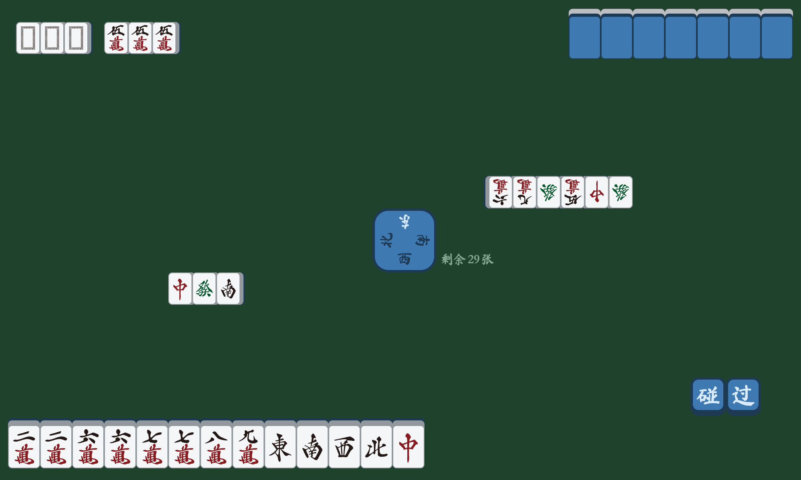
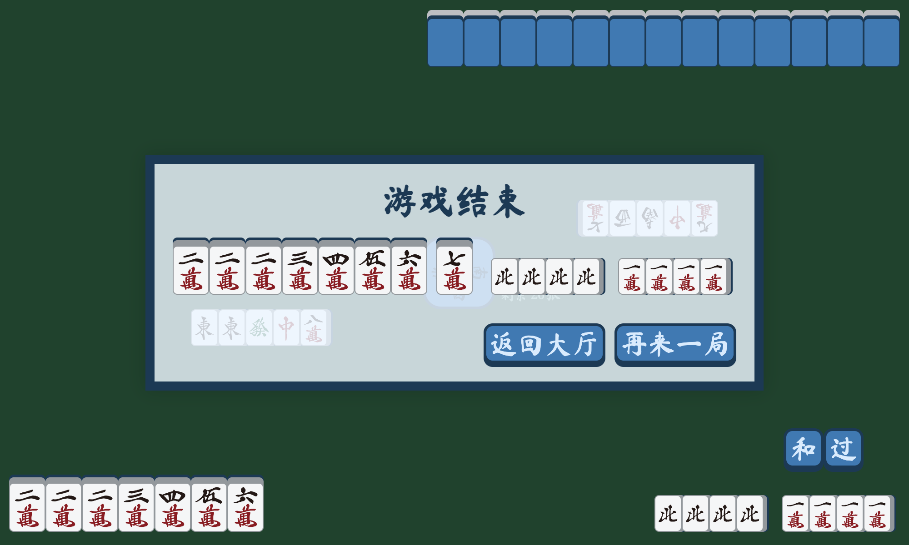

# Mahjong Game

Configurable Mahjong game with a pure HTML ans CSS interface. You can use this lib to create your own Mahjong game with your own rules.

A two player game is implemented as an example.

**DEMO:** <https://clysto.github.io/mahjong>

|                                       |                                       |
| ------------------------------------- | ------------------------------------- |
|  |  |
|  |  |
